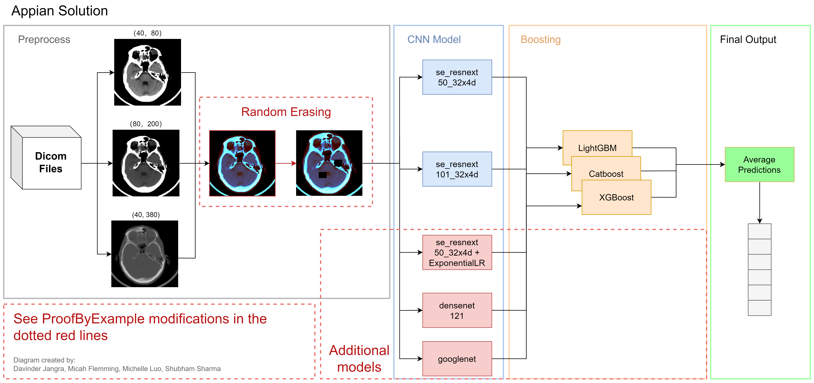
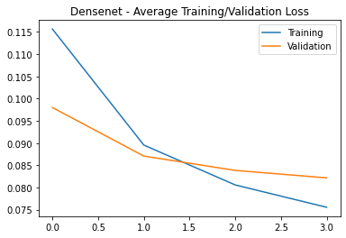
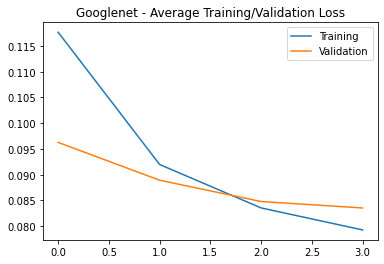

# **CSC490** | RSNA Intracranial Hemorrhage Detection
---

### **Group**: ProofByExample

### **Team Members**: Davinder Jangra, Micah Flemming, Michelle Luo, Shubham Sharma


## Table of Contents
  - [Solution Overview](#solution-overview)
    - [Appian](#appian)
    - [Model Tuning](#model-tuning)
    - [Additional Models](#additional-models)
    - [Compute Canada Environment](#compute-canada-environment)
  - [Repository Layout](#repository-layout)
  - [How to Run](#how-to-run)
    - [Requirements](#requirements)
    - [Preprocessing](#preprocessing)
    - [Training](#training)
    - [Predicting](#predicting)
    - [Second level model](#second-level-model)
    - [Ensembling](#ensembling)
  - [Results](#results)
    - [Trained Weights](#trained-weights)
    - [Visualizations](#visualizations)
    - [Summary](#summary)
  - [References](#references)

---

## Solution Overview



### [Appian Solution](https://github.com/appian42/kaggle-rsna-intracranial-hemorrhage)

Our solution stems from Appian's solution, which was the 11th placed model on Kaggle. Many high ranking solutions referenced Appian's work, and their repo was well organized with simple documentation. We believed that working off their results would be a good starting point for us. 

Appian's solution uses 
- three windows: brain `(40, 80)`, blood/subdural `(80, 200)`, soft tissues `(40, 380)`
- two pretrained models, each with 8 folds: `se_resnext50_32x4d`, `se_resnext101_32x4d`
- three gradient boosting algorithms: `LightGBM`, `Catboost`, `XGB`

This solution was written in 2019, therefore we had to make some modifications and updates to the environment. Please see [How to Run](#how-to-run) for more information.

### Model Tuning

We tried various modifications to the existing hyperparameters, however they did not impact the results much. 

The modifications done were as follows:
- increasing/decreasing batch size 
- using different learning rate schedulers (`EXPONENTIALLR`, `COSINEANNEALINGLR`, etc)
- changing input image size 
- using different optimizers (`SGD`, `adam`, etc)

### Additional Models

Since hyperparamter changes did not give us large improvements, we also wanted to try training our own models to see if ensembling more models could improve the overall score. After analyzing pretrained models, we decided to use Densenet and GoogLeNet.

#### Densenet
- A pretrained model with effective feature use 
- Has a more complex model architecture

#### GoogLeNet
- A well known pretrained model with a comparable top-5 error rate to `se_resnext` 
- Runs 27 layers deep and is less memory intensive to run compared to `densenet121 `

### Compute Canada Environment

We have included the slurm scripts that were used to run our jobs on Compute Canada. 
Our work can be seen here: `/home/mfjalon/projects/def-lakahrs/mfjalon/`

#### Dataset
**Location:** `/home/mfjalon/scratch/rsna-intracranial-hemorrhage-detection/`
**Train:** 565 999 / 752 803 files (75%)
**Test:** 121 232 / 121 232 files (100%)

---

## Repository Layout

We built upon Appian's [directory layout](https://github.com/appian42/kaggle-rsna-intracranial-hemorrhage/blob/master/README.md#directory-layout). 

We will only mention our changes made within their directory.

```
.
├── bin                           # Scripts to perform various tasks such as `preprocess`, `train`. 
    ├──  predict_pt_*.sh          # Modified versions of predict.sh.
    └── train_new_model_*.sh      # Modified versions of train.sh.
├── conf                          # Added new model conf files.
├── model                         # Where classification model outputs are saved.
    ├── model100_exp              # model100 + ExponentialLR model outputs.
    ├── model200                  # densenet model outputs.
    └── model210                  # googlenet model outputs.
├── meta                          # Where second level model outputs are saved.
└── src                           # Modified files include: ...
├── logs                              # Sample logs.
├── report                            # Report on dataset decision (Oct 4).
└── scripts                           # Slurm scripts for use on Compute Canada.
```


## How to Run

### Requirements

The library versions used. Original versions are also listed for easy comparison. See requirements.txt for extensive list (based on Compute Canada env).

Library | Original | Updated | 
--- | --- | --- | 
Python | 3.6.6 | 3.7.9 |
CUDA | 10.0 | 11.0 |
[Pytorch](https://pytorch.org/) | 1.1.0 | 1.6.0 |
[NVIDIA apex](https://github.com/NVIDIA/apex) | 0.1 | No change
Albumentations | 0.3.3 | 0.5.2 |
Catboost | 0.12.2 | 0.24 |
LightGBM | 2.2.2 | 3.2.1 |
Pretrained-models | 0.7.4 | No change |
XGBoost | 0.80 | 1.0.2 |

### Preprocessing

~~~
$ sh ./kaggle-rsna-intracranial-hemorrhage/bin/preprocess.sh
~~~

[preprocess.sh](./kaggle-rsna-intracranial-hemorrhage/bin/preprocess.sh) processes dicom files, creates datasets and folds. 
Slurm script equivalent is [run_preprocess.sh](./scripts/preprocess.sh)

### Training 

~~~
$ sh ./kaggle-rsna-intracranial-hemorrhage/bin/train.sh (ORIGINAL)
$ sh ./kaggle-rsna-intracranial-hemorrhage/bin/train_densenet.sh (NEW)
$ sh ./kaggle-rsna-intracranial-hemorrhage/bin/train_googlenet.sh (NEW)
~~~

##### ORIGINAL
Trains `se_resnext50_32x4d` and `se_resnext101_32x4d` with 8 folds each.

##### NEW
- `train_densenet.sh`: trains `densenet121`
- `train_googlenet.sh`: trains `googlenet`

### Predicting 

~~~
$ sh ./kaggle-rsna-intracranial-hemorrhage/bin/predict.sh
~~~

- Makes predictions for validation data and test data
- `predict_pt_*.sh` just splits `predict.sh` into multiple parts, for efficiency purposes on Compute Canada

### Second level model

~~~
$ sh ./kaggle-rsna-intracranial-hemorrhage/bin/predict_meta.sh (ORIGINAL)
$ sh ./kaggle-rsna-intracranial-hemorrhage/bin/predict_meta_updated.sh (NEW)
~~~

- Ensembles out-of-fold predictions from the previous step (used as meta features to construct train data)
- Ensembles test predictions from the previous step (used as meta features to construct test data)
- Trains `LightGBM`, `Catboost` and `XGB` with 8 folds each
- Predicts on test data using each of the trained models
- `predict_meta_updated.sh` does the above, but for our new models

### Ensembling

~~~
$ sh ./kaggle-rsna-intracranial-hemorrhage/bin/ensemble.sh (ORIGINAL)
$ sh ./kaggle-rsna-intracranial-hemorrhage/bin/ensemble_updated.sh (NEW)
~~~

- Calculates final predictions using previous step
- `ensemble_updated.sh` does the above, with the original solution and our new models

---

## Results

### Trained Weights

Since the fully trained models are very large, we have not uploaded them to the repo. Similarily, Appian's trained weights can be downloaded [here](https://github.com/appian42/kaggle-rsna-intracranial-hemorrhage#trained-weights).

However, our fully trained models can be found on Compute Canada, as foldX_epY.pt files: `/home/mfjalon/projects/def-lakahrs/mfjalon/kaggle-rsna-intracranial-hemorrhage/model/`

Directory | Model Type |
--- | --- |
model100 | `se_resnext50_32x4d` |
model110 | `se_resnext101_32x4d` |
model100_exp | `se_resnext50_32x4d` with `ExponentialLR` |
model200 | `densenet121` |
model210 | `googlenet` |


### Visualizations

These are the training and validation loss curves for `densenet` and `GoogLeNet`. 

Both models used the following hyperparameters:
- 4 epochs
- batch size of 28
- multi-step LR scheduler
- binary cross entropy loss function
- adam optimizer

Densenet | GoogLeNet |
--- | --- |
 |  |

### Summary

See a summary of our model results in the table below:

Model | Average Validation Loss | Average AUC Score |
--- | --- | --- |
googlenet | 0.07 | 0.98 |
densenet121 | 0.0748 | 0.977 |
se_resnext (ExponentialLR) | 0.069 | 0.983 |
se_resnext | 0.0568 | 0.989 |

We also submitted our results to Kaggle, where we received the following scores on the private leaderboard:

Submission | Rank | Score | Description |
--- | --- | --- | --- |
0 | 11 | 0.04719 | Original solution score |
1 | 12 | 0.04732 | Recreated results using Appian model |
2 | 37 | 0.05240 | Densenet PBE model |

---

## References

- [Appian Github](https://github.com/appian42/kaggle-rsna-intracranial-hemorrhage)
- [Appian Writeup](https://www.kaggle.com/c/rsna-intracranial-hemorrhage-detection/discussion/117330)
- [SeuTao Github](https://github.com/SeuTao/RSNA2019_Intracranial-Hemorrhage-Detection)
- [ONNX Model Zoo](https://github.com/onnx/models)
